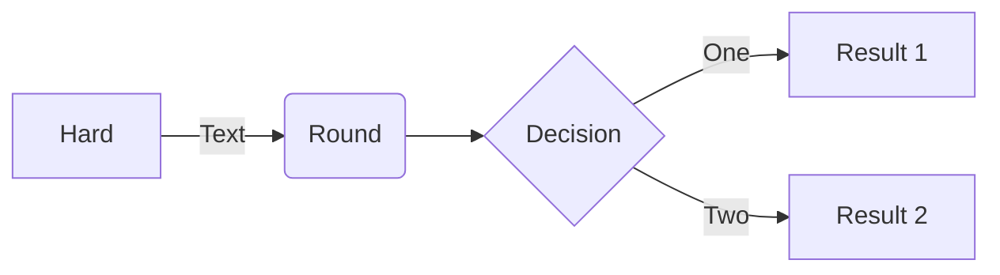

# Notes

* [UNIX](pages/unix.md)
* [C++](pages/cpp.md)
* [DPKG](pages/dpkg.md)
* [Git](pages/git.md)
* [SQL](pages/sql.md)
* [Kafka](pages/kafka.md)
* [Docker](pages/docker.md)

```mermaid
flowchart LR

A[Hard] -->|Text| B(Round)
B --> C{Decision}
C -->|One| D[Result 1]
C -->|Two| E[Result 2]
```
